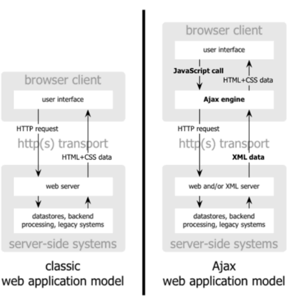

# AJAX

# Introduccion

* AJAX es un acrónimo de Asynchronous JavaScript + XML, que se puede traducir como "JavaScript asíncrono + XML".
* AJAX es un conjunto de tecnologías:
> * JavaScript
> * XML, JSON, XLST
> * XMLHttpRequest
> * DOM
> * XHTML, CSS
* El intercambio de información con el servidor se produce de forma asíncrona, no hay que esperar a que el servidor genere toda la página HTML y la envíe, sólo la información solicitada.

# Tecnologia AJAX



# Estructura aplicacion AJAX

* Pasos en una aplicación AJAX:
1. Instanciar el objeto XMLHttpRequest
2. Preparar la función de respuesta
3. Realizar la petición al servidor
4. Ejecutar la función de respuesta.

# XMLHTTPRequest

* Objeto para establecer la comunicación con el servidor en segundo plano, sin necesidad de recargar las páginas.
* Según el navegador el objeto es diferente:
> * Navegadores que siguen los estándares:
> * * XMLHttpRequest();
> * Explorer previos al 7:
> * * ActiveXObject


# XMLHTTPRequest Metodos


# Ejemplo AJAX

```js
var READY_STATE_UNINITIALIZED=0;
var READY_STATE_LOADING=1;
var READY_STATE_LOADED=2;
var READY_STATE_INTERACTIVE=3;
var READY_STATE_COMPLETE=4;

var peticion_http;

function cargaContenido(url, metodo, funcion) {
    peticion_http = inicializada_xhr();

    if(peticion_http) {
        peticion_http.onreadystatechange = funcion;
        peticion_http.open(metodo, url, true);
        peticion_http.send(null);
    }
}

function inicializa_xhr(){
    if(window.XMLHttpRequest){
        return new XMLHttpRequest();
    } else if (windows.ActiveXObject){
        return new ActiveXObject("Microsoft.XMLHTTP");
    }
}

function muestraContenido(){
    if(peticion_http.readyState == READY_STATE_COMPLETE){
        if(peticion_http.status == 200){
            alert(peticion_http.responseText);
        }
    }
}

function descargaArchivo(){
    cargarContenido("http://localhost/holamundo.txt", "GET", muestraContenido);
}

window.onload = descargaArchivo;
```


# Envio de Parametros

* XMLHttpRequest permite el envío de parámetros con el método GET y con el método POST.
* Los parámetros se envían como pares clave=valor separados por &
> * http://host/aplicacion?p1=v1&p2=v2&p3=v3
> * Con GET se envían con la URL: Se accede un recurso que depende de la información enviada
> * Con POST se envían en el cuerpo de la petición: se crea, borra o actualiza información.