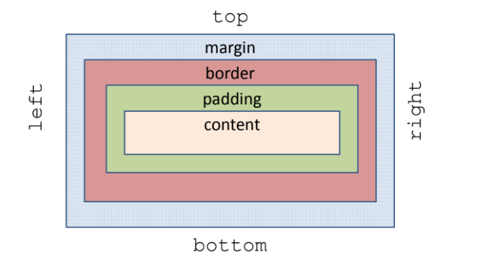

# Introduccion a CSS

# CSS

Es un lenguaje para definir la presentación de un documento HTML.
Se logra separar presentación y contenido:
* HTML/XHTML se usa para marcar el documento, para definir los elementos en él: párrafos, listas, tablas, texto, etc.
* CSS para definir la apariencia de los elementos: color, tamaño, posición, etc.

# Motor web

Un motor web (web engine o layout engine) es la parte del navegador encargada de tomar la información del HTML y del CSS y renderizarla en la ventana del navegador.

# Estándar

* CSS es un estándar impulsado por el W3C.
* La versión de CSS que utilizan todos los navegadores de hoy en día es CSS 2.1
* CSS 3 está aún en desarrollo.

# Insertar CSS (I)

En la sección ```html<head>``` del documento HTML utilizando el elemento ```html<style>```
```html
<html>
    <head>
        <title> Hola Mundo </title>
        <style type="text/css">
            - Coding
        </style>
    </head>
    <body>
        <p>UyA</p>
    </body>
</html>

```

# Insertar CSS (II)

* Definir el estilo mediante un archivo .css
* Se debe utilizar la etiqueta ```html<link>``` para enlazar el documento HTML al archivo con los estilos.
* Se deben especificar los atributos rel, type, href y media:

```html
<html>
    <head>
        <title> Hola Mundo </title>
        <link media="screen" href="./estilo.css" type="text/css" rel="stylesheet">
    </head>
    <body>
        <p>UyA</p>
    </body>
</html>

```

# Insertar CSS (III)

* Se puede insertar en los elementos HTML.
* No se aconseja, sólo se usa para aplicarlo a un elemento puntualmente.

```html
<html>
    <head>
        <title> Hola Mundo </title>
        <link media="screen" href="./estilo.css" type="text/css" rel="stylesheet">
    </head>
    <body>
        <p>UyA</p>
        <p style="color: green; font-family: Verdana,">Usar casos puntuales</p>
    </body>
</html>

```

# Reglas

Los estilos en CSS se definen mediante reglas con la siguiente sintaxis: ```selector {propiedad : valor;} ```
* El selector es el elemento al que se aplica la regla.
* La declaración indica qué hay que hacerle
* La declaración puede incluir varias propiedades separadas por ;

```CSS
p {
    color: red;
    font-family: Arial;
} 
```

# Selectores

* Selector de tipo o etiqueta
* Selector universal *, se aplica a todos los elementos de la página.
* Si varios elementos tienen el mismo estilo se puede definir una única regla con los selectores separados por ,

```CSS
p {
    color: red;
    font-family: Arial;
} 

p a {
    color: blue;
} 
```

# Selector de clase

```<etiqueta class =“clase”>```
* ```.clase{ Declaración }``` Todos los elementos con atributo class = clase
* ```etiqueta.clase { Declaración }``` Todo los elementos de tipo etiqueta con atributo class = clase.
* ```etiqueta .clase { Declaración }``` Todos los elementos con atributo class = clase que estén dentro de etiqueta.

<ins><hi>Ejemplo</h1></ins>

En el HTML
```html
<html>
    <head>
        <title> Hola Mundo </title>
        <link media="screen" href="HTML/pruebaclases.css" type="text/css" rel="stylesheet">
    </head>
    <body>
        <p>
            Primera prueba Usabilidad y Accesibilidad
            <a href="http://www.ull.es"> ULL </a>
        </p>
        <p style="color: green; font-familiy: Verdana;"> Usar en casos puntuales </p>
        <p class="clase1"> A esto le aplicamos una clase en CSS </p>
        <p class="clase1 clase2"> A esto le aplicamos la clase </p>
        <p class="clase1">
            <a class=clase2" href="http://www.ull.es"> ULL </a>
        </p>
    </body>
</html>
```
En el CSS

```CSS
.clase1 {
    color: blue;
    font-family: Arial;
} 

p.clase2 {
    color: red;
} 

p .clase2 {
    color: green;
}
```

# Selector de id

```<etiqueta id=“idelemento”>```
#idelemento{ Declaración} 
* Todos los elementos con cuyo id es "idelemento"
* Se utiliza cuando la regla se aplica a un único elemento, ya que el valor del atributo id debe ser único.


# Colisiones de estilos

* Las reglas que se definen pueden aplicar distintos estilos a un mismo elemento.
* CSS tiene un mecanismo para establecer cuál de todas ellas se aplicaría.
* Se pueden definir distintos tipos de importancia que se aplican para resolver las colisiones.
* Influye también el tipo de CSS: de navegador, usuario, diseñador.
* El caso más simple se basa en determinar la regla más específica. En caso de varias con el mismo nivel de restricción se aplica la última


# Medidas

Las medidas en CSS tienen la sintaxis:
* Valor numérico unidad de medida:
* * Sin espacio entre el valor y la unidad
* * El valor puede ser entero o decimal.
* Las medidas pueden ser:
* * Absolutas: se especifica directamente el valor que toma el elemento: ```in cm mm pt pc```
* * Relativas: se especifican en función de otra medida.

# Medidas Relativas

* ```em``` el valor base es el tamaño de la letra M del tipo que se está utilizando.
* ```ex``` el valor base es el tamaño de la letra x que se está utilizando.
* ```px``` el valor base es el tamaño del píxel de la pantalla que utiliza el usuario.
* ```0.9em 1.20em 0.9px 1.20px```

* Se pueden usar distintas unidades en la misma página:
* ```body { font size: 10px }```
* ```h1 { font-size: 1.20em }```
* * En este caso se usa el valor base de 10 píxel para toda la página y el elemento h1 tendrá un valor de 1.20*10px = 12px
* Las medidas relativas se heredan de los valores ya calculados:
```css
body { font-size: 12px;
       text-indent: 3em }
h1   { font-size: 15px }
```
* Se pueden especificar medidas relativas con porcentajes:
* valor numérico%

# Colores:

Se pueden especificar mediante palabras clave

* RGB: color: rgb(valorR , valorG, valorB)
* * Valor decimal entre 0 y 255
* * Porcentaje: 0% ‐‐ 100%
* * hexadecimal #hexRhexGhexB se pueden comprimir los valores dobles.

# Reglas especiales

* ```@media medio``` medio especifica el medio al que se le aplicará la regla
```print screen handled braille, etc.```

* ```@import url``` url especifica un archivo CSS externo.

# Modelo de cajas

En CSS cada elemento de HTML‐XHTML se considera dentro de una caja a la que se le puede definir:
* Ancho, alto de la caja.
* Margen entre cajas
* Espacio de relleno

Respecto al comportamiento, las cajas se pueden ocultar, indicar su posición, etc.

* Partes de una caja:
* * Contenido ```content```
* * Relleno ```padding```
* * Borde ```border```
* * Imagen de fondo ```background image```
* * Color de fondo ```background color```
* * Margen ```margin```



* Relleno y margen son transparentes.
* En el relleno se muestra el color o imagen de fondo del elemento.
* En el margen se muestra el color o imagen de fondo del elemento padre.
* Si se usan tanto imagen como color de fondo se muestra la imagen.

# Ancho‐Alto

```width```  medida | % | auto | inherit <br>
```height``` medida | % | auto | inherit
* ```%``` se calcula en función del padre.
* ```inherit``` se aplica el valor que tenga el padre.
* ```auto``` el navegador lo calcula automáticamente


# Margen

> * margin-top
> * margin-bottom
> * marign-right
> * margin-left

* margin admite hasta 4 valores:

> * valor1 se aplica a ```todos los márgenes```
> * valor1 valor2: ```top bottom, left right```
> * valor1 valor2 valor3: ```top, left right, bottom```
> * valor1 valor2 valor3 valor4: ```top, right, bottom, left```

* Cuando un elemento contiene a otro, se fusionan los márgenes verticales, considerando sólo el margen mayor.
* ```medida | % |auto | inherit```

# Relleno

> * padding-top
> * padding-bottom
> * padding-right
> * padding-left

* padding admite hasta 4 valores:

> * valor1 se aplica a ```todos los márgenes```
> * valor1 valor2: ```top bottom, left right```
> * valor1 valor2 valor3: ```top, left right, bottom```
> * valor1 valor2 valor3 valor4: ```top, right, bottom, left```
* ```medida | % |inherit```

# Borde
<ins><hi>Ancho</h1></ins>
> * border-top-width
> * border-bottom-width
> * border-right-width
> * border-left-width

* border-width admite hasta 4 valores:

> * valor1 se aplica a ```todos los márgenes```
> * valor1 valor2: ```top bottom, left right```
> * valor1 valor2 valor3: ```top, left right, bottom```
> * valor1 valor2 valor3 valor4: ```top, right, bottom, left```

* ```medida | thin |medium |thick | inherit```

<ins><hi>Color</h1></ins>

> * border-top-color
> * border-bottom-color
> * border-right-color
> * border-left-color

* border-color admite hasta 4 valores:

> * valor1 se aplica a ```todos los márgenes```
> * valor1 valor2: ```top bottom, left right```
> * valor1 valor2 valor3: ```top, left right, bottom```
> * valor1 valor2 valor3 valor4: ```top, right, bottom, left```

* ```color| transparent | inherit```

<ins><hi>Style</h1></ins>

> * border-top-style
> * border-bottom-style
> * border-right-style
> * border-left-style

* border-style admite hasta 4 valores:

> * valor1 se aplica a ```todos los márgenes```
> * valor1 valor2: ```top bottom, left right```
> * valor1 valor2 valor3: ```top, left right, bottom```
> * valor1 valor2 valor3 valor4: ```top, right, bottom, left```

* ```none | hidden | dotted | dashed | groove | ridge | inset | outset |inherit```

> * border-top
> * border-bottom
> * border-right
> * border-left

* ```medida || color || estilo```

***********************************************************

* El ancho/alto de un elemento se obtiene de la suma del ancho/alto de cada una de las partes de la caja:
```relleno + borde + márgenes + elemento```
* Los navegadores antiguos no usaban el modelo de cajas (box model).
* Según el DOC TYPE se utiliza el modelo de cajas o el modelo “quirk”

# Fondo

* Puede ser color o una imagen. Sólo es visible en el contenido y el padding. El margen es transparente.

```background-color: color | none | inherit```<br>
```background-image: url | none | inherit```

* Si la imagen es mayor se recorta al tamaño del elemento. Si es menor, se repite:

```background-repeat: repeat | repeat‐x | repeat‐y | no‐repeat | inherit```

# Modelos de posicionamiento

* Posicionamiento *normal o estático*: Ninguna caja se desplaza respecto a su posición. Ésta se determina en función de que el elemento sea de tipo bloque o en línea.
* Posicionamiento *relativo*: Se posiciona el elemento según el modelo normal, y luego se desplaza respecto a la posición original. Las restantes cajas no ocupan el lugar que deja.<br>
 ```position: static | relative | absolute | fixed | inherit```

* Posicionamiento *absoluto*: Su posición en la pantalla es inamovible. Las restantes cajas ocupan el espacio de la caja desplazada. La posición se desplaza en función del borde del del primer contenedor estático del elemento. El caso fijo es un caso particular.
* Los desplazamientos se controlan con las propiedades: 

```top, right, bottom, left: medida | % |auto | inherit```

* Posicionamiento *flotante*: Se desplaza la caja todo lo más posible a la derecha o la izquierda. Las restantes cajas pueden ocupar su lugar.
* Si hay otra caja flotante se posiciona en función del espacio libre.
* Los elementos en línea hacen sitio adaptando su tamaño al espacio dejado por la caja flotante.
* Los elementos en bloque adaptan el contenido para no solaparse.<br>
```float: left | right | none | inherit```


# Visualización

```display: inline | block | none | ...```
* *inline* muestra el elemento como si fuese de tipo inline, aunque no lo sea.
* *block* muestra el elemento como si fuese de tipo block, aunque no lo sea.
* *none* oculta el elemento. El resto puede ocupar su lugar.<br> 

```visibility: visible | hidden | collapse | auto``` 
* Oculta el elemento pero reserva el espacio <br>

```overflow: visible | hidden | collapse|auto```
* Comportamiento si se desborda el contenido de la caja <br>

```z-index: auto | numero | inherit```
* Se usa para indicar qué caja se muestra delante de otra en caso de solapamientos. El 0 corresponde al nivel menor.

# Texto

```color: color | inherit```
* Define el color del texto. Es una propiedad que se hereda salvo el caso de los enlaces.

```font-family: (nombre‐familia) | (familia‐genérica)```
* Se puede especificar un lista de familias, se aplica la 1a disponible.
* Las fuentes se agrupan en 5 familias genéricas: serif, sans‐serif, monospace, cursive, fantasy. Si no se encuentra la fuente se aplica la más parecida dentro de la familia genérica.

```font-size: tamaño absoluto | tamaño relativo | medida | % | inherit```

* Tamaño absoluto: xx‐small, x‐small, small, medium, large, x‐large, xx‐large
* Tamaño relativo: larger smaller . La referencia es el tamaño del elemento padre.

```font-weight: normal | bold ....```<br>
```font-sytle: normal | italic | oblique | inherit```<br>
```font```<br>

```text-align: left | right | center | justify | inherit ```
```line-height: normal | numero | medida | % | inherit```
* Numero indica un múltiplo del tamaño de letra
* ```vertical-align: baseline | sub | super | top | text‐top | middle | bottom | text‐bottom | porcentaje | <medida> | inherit```
* ```text-indent: medida | % | inherit```

* ```letter-spacing: normal | medida | inherit```
* ```word-spacing: normal | medida | inherit```<br>
medida se interpreta como espacios adicionales que se añaden (cuando es positivo) o quitan (cuando es negativo respecto a la separación por defecto

* ```white-space: normal | pre | nowrap | pre‐wrap | pre‐line | inherit```
Tratamiento que se da a los espacios en blanco y nueva línea:
* ```pre``` se respetan espacios en blanco y nueva línea. Si la línea es muy larga se sale del contenido.
* ```nowrap``` elimina espacios en blanco y nueva línea. Si la línea es muy larga se sale del contenido
* ```pre‐wrap``` Se respetan espacios en blanco y nueva línea. Si la línea es muy larga se adapta al contenido.
* ```pre‐line``` elimina espacios en blanco y respeta nueva línea. Si la línea es muy larga se adapta al contenido.

```:first-line``` Se aplica el estilo a la primera línea del contenido
```:first-letter``` Se aplica el estilo a la primera letra del contenido

# Pseudo‐clases

Permiten aplicar estilos a los enlaces según su estado:<br>

```a:link{ ... }```<br>
```a:hover { ... }```<br>
```a:visited { ... }```<br>
```a:active { ... }```