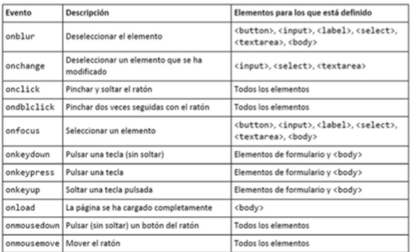
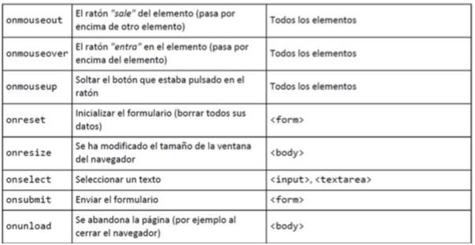

# JavaScript

* Lenguaje de programacion *interpretado* que permite agregar interaccion y dinamismo a las paginas web
* Los programas se ejecutan en el navegador cliente
* No se da acceso a los recursos del ordenador
* No es un lenguaje de proposiyo general
* Un *Script* es cada uno de los programas, aplicaciones o trozos de codigo

# Incluir JavaScript

Incluir el codigo en la pagina:
```html
<html>
    <head>
        <title> Hola Mundo </title>
        <link rel="stylesheet" type="txt/css" href="/pruebaclases.css" media="screen" />
        <script>
            console.log('Hola');
            alert('Hola Mundo');
        </script>
    </head>
</html>
```

Codigo en un archivo externo
```html
<html>
    <head>
        <title> Hola Mundo </title>
        <link rel="stylesheet" type="txt/css" href="/pruebaclases.css" media="screen" />
        <script src = "js/introJava.js" type = "text/javascript">
        </script>
    </head>
</html>
```

# Sintaxis JavaScript

* Declaracion simple de variable:
```js
var foo = 'Hello World';
```
- * Una variable que no se declara sera global
- * El tipo de variable sera string, entera, decimal , boolen segun el tipo de dato que se le asigna.

* Los espacios en blanco se ignoran fuera de las comillas
* Los parentesis indican prioridad
* La tabulacion mejora la lectura del codigo, pero no posee ningun isgnificado especial
* ```;``` no es obligatorio pero es recomendable
* Se usan comentarios al estilo C <br>
---

* Operadores: 

Asignacion
```
=
```
Aritmeticos
```
+ - * / ++ -- %
```
Logicos
```
! && ||
```
Comparacion
```
> < >= <= == !=
```
---

* Arrays
```js
var NombreArray = [valor1, valor2, valor3, ..., valorN]
```
* Pueden incluir diferentes tipos de datos
* Se indexan comenzando en 0
* Funciones utiles

```js
NombreArray.length()
NombreArray.concat()
NombreArray.split()
NombreArray.join(separador)
NombreArray.push()
NombreArray.pop()
NombreArray.shift()
NombreArray.unshift()
NombreArray.reverse()
```
---

* Funciones utiles para numeros:
```js
NaN
Numero.isNaN(Valor)
Numero.toFixed(Digitos)
```
* Funciones utiles para String:
```js
Cadena.length()
+
Cadena.concat()
Cadena.toUpperCase()
Cadena.toLowerCase()
Cadena.charAt(posicion)
Cadena.indexOf(caracter)
Cadena.lastIndexOf(caracter)
Cadena.substring(inicion, fin)
Cadena.split(separador)
```
---

* Sentencias condicionales
```js
if(condicion){

    // Codigo

} else {

    // Codigo

}
```

```js
switch(dato){
    case valor1:
        // Codigo
    break;
    case valor2:
        // Codigo
    break;
    case valor3:
        // Codigo
    break;
    case valor4:
        // Codigo
    break;
    default:
        // Codigo
    break;
}
```
---

* Bucles
```js
for([exprInicial]; [condición]; [incremento]){ 
    // Codigo
}
```

```js
while ([condición]){ 
    // Codigo
}
```

```js
do{
    // Codigo
} while([condición])
```


# Funciones

```js
function nombreFuncion(){
    // Codigo
}

var nombreFuncion = function() { 
    // Codigo
}
```
* Si devuelve un valor:
```js
return valor;
return function() { 
    // Codigo
};
```

# Mas JavaScript

**Objetos:**<br>
Los objetos son elementos que pueden contener cero o mas conjuntos de pares de nombres claves y valores asociados a dicho objeto

> * Los **nombres claves** pueden ser cualquier palabra o numero valido
> * El **valor** puede ser cualquier tipo de valor: un numero, una cadena, un arreglo, una funcion, includo otro objeto
> * En realidad son arrays asociativos: indexados segun valores dados (clave) y no segun la posicion
> * Un objeto puede ser un elemento de otro objeto
> * Hay objetos definidos en JavaScript: ```string```, ```Array```, ```Òbject```, ect

```js
var ejemploObjeto = new Object();

ejemploObjeto['propiedad1'] = valor1;
ejemploObjeto['propiedad1'] = valor2;

ejemploObjeto['metodo1'] = function(){ 
    // Codigo
}

--------------------------------------

ejemploObjeto.propiedad1 = valor1;
ejemploObjeto.propiedad1 = valor2;

ejemploObjeto.metodo1 = function(){ 
    // Codigo
}

```

# JSON

**JSON** es un formato de intercambio de informacion
* Se puede representar arrays y objetos:
> * Los arrays: ```[elemento1, elemento2, elemento3]```
> * Los objetos: ```{propiedad1: valor1, propiedad2: valor2, metodo1: function(){ // Codigo } }```

---

```js
var ejemploObjeto = {
  propiedad1 : valor1,
  propiedad2:  valor2,
  metodo1: function(){ 
      // Bloque código
  } 
}
```
---

# Alcance de JavaScript

- Variables declaradas dentro de funciones utilizando la palabra clave **var**, son locales a la funcion
- Las variables que son declaradas dentro de la funcion sin la palabra clave **var** no quedan dentro del ambito de la misma funion - JavaScript buscara el lugar donde la variable fue declarada, y en ese caso de no haber sido declarada, es una variable global

# Eventos en JavaScript

* Un evento es algo que puede ocurrir mientras se ejecuta un programa
> * Mover el raton, pulsar una tecla

* Se ejecutan ciertas acciones que programemos con JavaScript cuando suceda uno de esos eventos

* Para asociar un evento a un elemto de la pagina HTML:
> * ```<ETIQUETA atributo=valor onEvento="programaJs;">```

* Entre comillas dobles podemos
> * Llamar a una funcion JavaScript
> * Poner varias instrucciones directamente

* Debemos conocer los eventos que pueden asociarse a cada elemento

# Eventos I



# Eventos II



# Arbol DOM

* Permite tratar los elementos de las paginas como nodos de documentos XML
* Se pueden obtener las interconexiones y las relaciones entre ellos
* La transformacion de las etiquetas XHTML
habituales genera dos nodos:
> * "Elemento" (Correspondiente a la propia etiqueta XHTML)
> * "Texto" que contiene el texto encerrado por essa etiqueta XHTML
---

* Si una etiqueta HTML se encuentra dentro de otra, se sigue el mismo procedimiento, los nodos generados seran hijos de su etiqueta padre.

* El acceso a los nodos, su modificacion y su eliminacion solamente es posible cuando el arbol DOM ha sido construido completamente, es decir, despues de que la pagina XHTML se cargue por completo
 
# Accesos a Elementos

* Eliminar nodos: ```removeChild()``` requiere como parametro el nodo que se va a eliminar
* Debe ser invocada desde el elemnto padre de ese nodo que se quiere eliminar
* La forma mas segura y rapida de acceder al nodo padre de un elemento es mediante la propiedad ```nodoHijo.paretNode````

# Manejo de los elementos del formulario

* Podemos encontrar los elementos de formulario desde JavaScript:
> * Comprobar si un elemento tiene valor o esta vacio
> * Asignar valores a los campos de formulario en funcion de eventos
> * Comprobar el formato del dato que contiene un elemento

* Acceso a los elementos del formulario:
```document.nombreFormulario.nombreElemento.value````

# Metodos Utiles DOM
```js
document.getElementById(id) 
document.getElementsByTagName(name)
document.getElementsByClassName(name)

element.innerHTML = new html content 
element.attribute = new value 
element.style.property = new style 
element.setAttribute(attribute, value)

document.createElement(element) 
document.removeChild(element) 
document.appendChild(element) document.replaceChild(new, old) 
document.write(text)

document.getElementById(id).onclick = function(){code}
```
